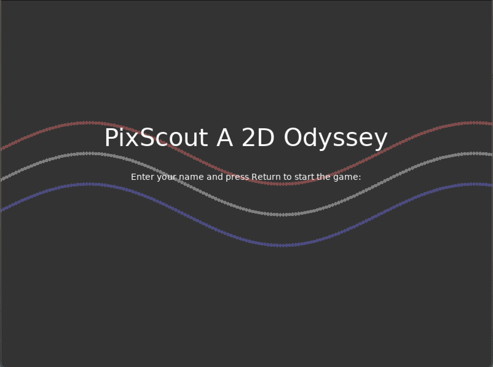
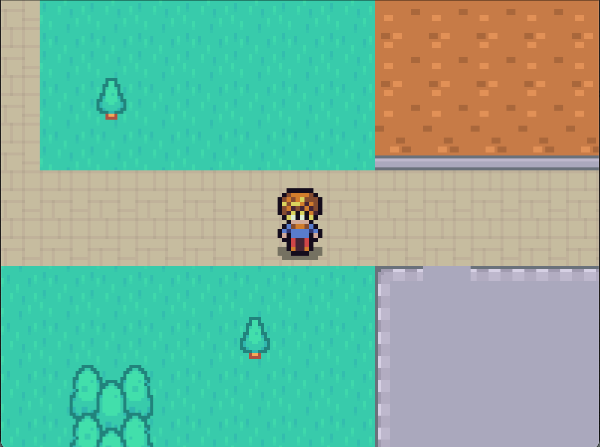

# First Game on LUA
My first project in LUA. Never knew any LUA before this so it's still a work in progress haha.

A 2D game with animated sprites, follow-around camera, and in-game physics.

Built with LUA and LÖVE 2D.

  

  

# Getting Started
Here are the steps you need to follow to run this game on your local machine.

## Prerequisites

Install LUA
Install LÖVE 2D. Make sure the version you install is compatible with the LUA version you have installed.
Installing and Running the Game

## Clone the repository:
git clone https://github.com/yourusername/yourrepository.git
Replace 'yourusername' and 'yourrepository' with your GitHub username and the repository's name respectively.

## Navigate 
to the cloned repository's directory.

## Run the game:
If you are on Windows, drag the whole game folder onto the love.exe file.
For MacOS and Linux, use the terminal and type:
love .
in the directory of the game folder.

## Enjoy playing the game!

## Contributing
Feel free to fork this project and enhance it in any way. Your contributions are heartily welcome!

## Acknowledgements
This project wouldn't have been possible without the learning resources and libraries from the community. Special thanks to the creators of the libraries used in this project.

## License
This project is licensed under the MIT License. Please refer to the LICENSE file for details.

