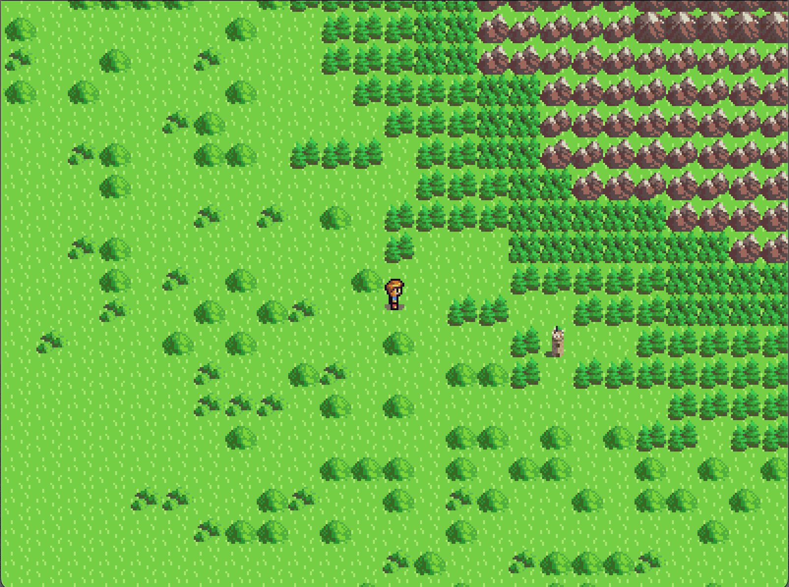

# First Game on LUA
My first project in LUA. Never knew any LUA before this so it's still a work in progress haha.

A 2D game with animated sprites, follow-around camera, and in-game physics.
Now implemented modular game loading to allow users to load different games from menu.

Game1 has a simpler map, while Game2 has a larger and slightly more complex map.

Built with LUA and LÖVE 2D.

  

  

  

# Getting Started
Here are the steps you need to follow to run this game on your local machine.

## Prerequisites

Install LUA
Install LÖVE 2D. Make sure the version you install is compatible with the LUA version you have installed.
Installing and Running the Game

## Clone the repository:
git clone [https://github.com/joshuakatt/PixScout-A-2D-Odyssey.git](https://github.com/joshuakatt/PixScout-A-2D-Odyssey)
Replace 'yourusername' and 'yourrepository' with your GitHub username and the repository's name respectively.

## Navigate 
to the cloned repository's directory.

## Run the game:
If you are on Windows, drag the main game folder onto the love.exe file. or simply (Ctrl + L)
For MacOS and Linux, use the terminal and type:
main.lua
in the directory of the game folder. or simply (Cmd + L)

else 

## Enjoy playing the game!

## Contributing
Feel free to fork this project and enhance it in any way. Your contributions are heartily welcome!

## Acknowledgements
This project wouldn't have been possible without the learning resources and libraries from the community. Special thanks to the creators of the libraries used in this project.
I used the STI library for tiled that can be found here: [STI](https://github.com/karai17/Simple-Tiled-Implementation/tree/master/sti)
and the anim8 library for animations that can be found here: [anim8](https://github.com/kikito/anim8). I used the camera implementiation from this repo [here](https://github.com/vrld/hump/blob/master/camera.lua)

## License
This project is licensed under the MIT License. Please refer to the LICENSE file for details.

